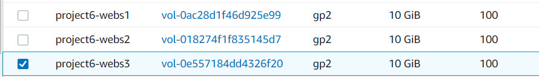
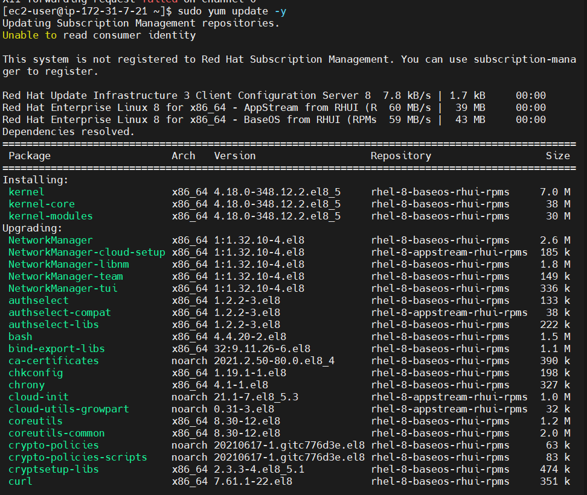
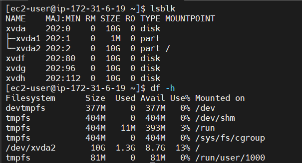
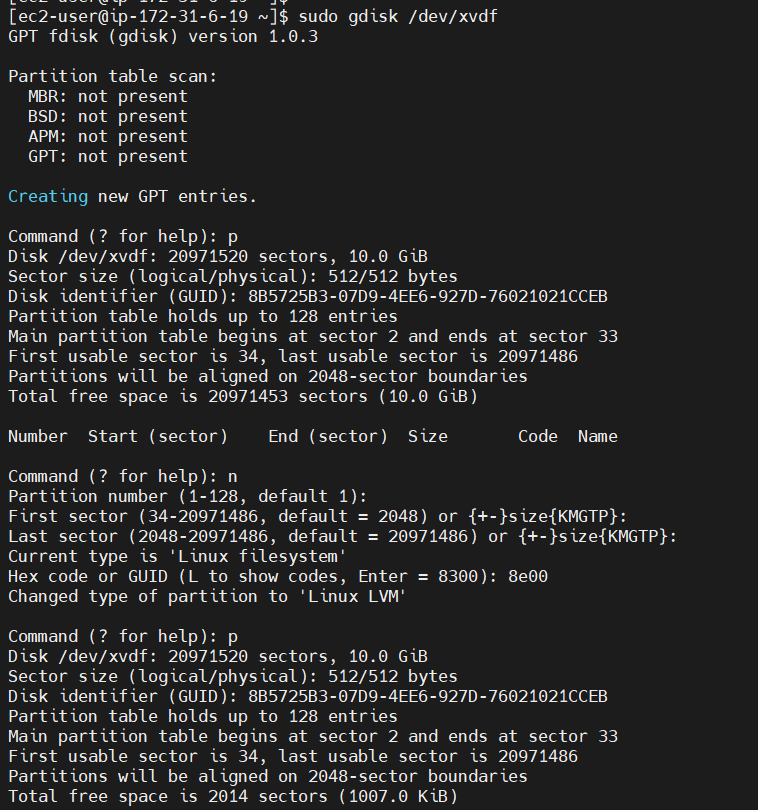
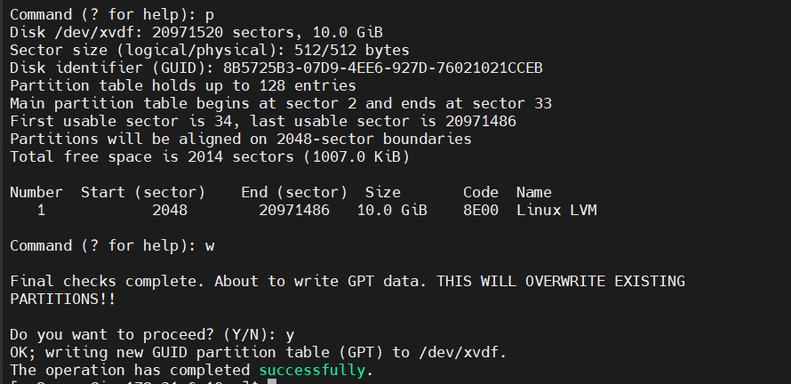
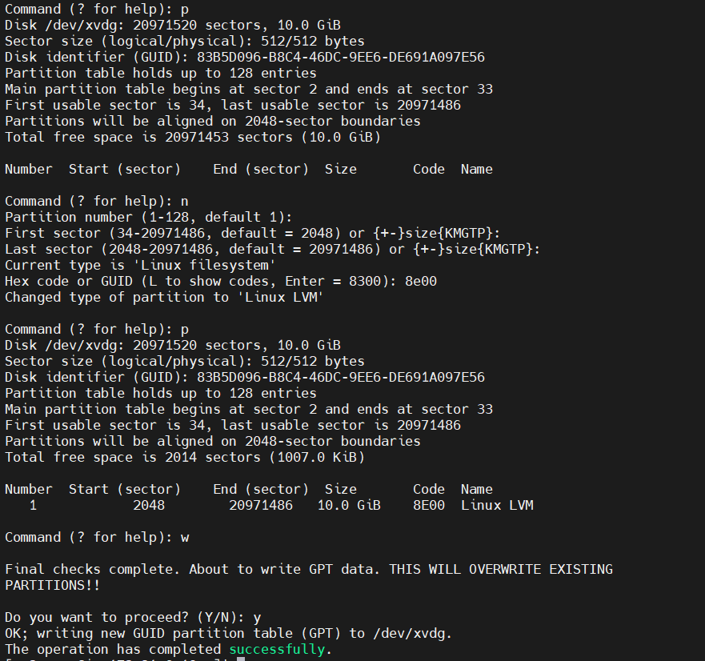
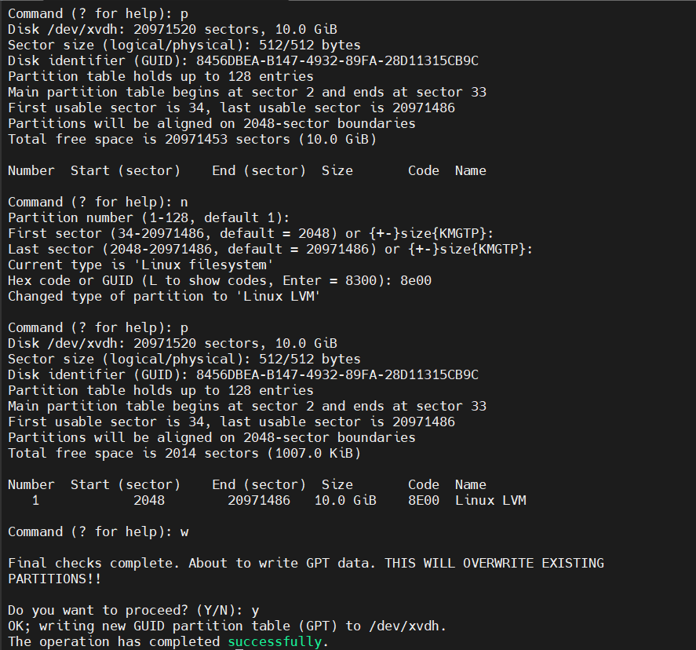
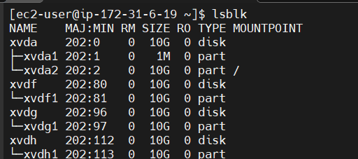
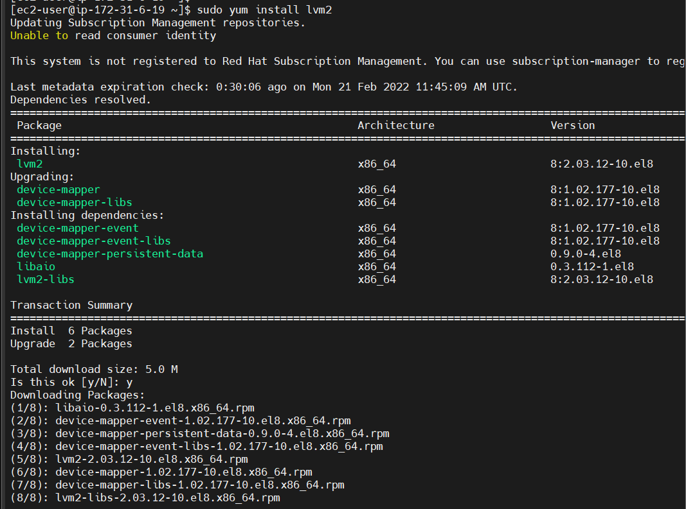
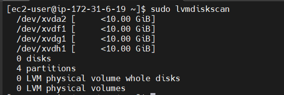

# Project 6

Launching an EC2 Instance that will serve as a Web Server and attaching three 10G volumes to it

___

updating red hat

` $ sudo yum update -y`

inspecting the block devices attached to the server

` $ lsblk`

confirming how much space i have on the disks

` $ df -h`

creating single partitions on each of the 3 disks

` $ sudo gdisk /dev/xvdf`

` $ sudo gdisk /dev/xvdg`

` $ sudo gdisk /dev/xvdh`

viewing the newly configured partition on the disks

` $ lsblk`

installing lvm2 package and checking for available partitions

` $ sudo yum install lvm2 -y`

` $ sudo lvmdiskscan`

