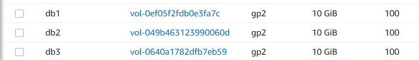

# Project 6

Launching an EC2 Instance that will serve as a Web Server and attaching three 10G volumes to it

___

updating red hat

` $ sudo yum update -y`

inspecting the block devices attached to the server

` $ lsblk`

confirming how much space i have on the disks

` $ df -h`

creating single partitions on each of the 3 disks

` $ sudo gdisk /dev/xvdf`

` $ sudo gdisk /dev/xvdg`

` $ sudo gdisk /dev/xvdh`

viewing the newly configured partition on the disks

` $ lsblk`

installing lvm2 package and checking for available partitions

` $ sudo yum install lvm2 -y`

` $ sudo lvmdiskscan`

creating physical volumes for each disk

` $ sudo pvcreate /dev/xvdf1`

` $ sudo pvcreate /dev/xvdg1`

` $ sudo pvcreate /dev/xvdh1`

verifying that physical volumes were created 

` $ sudo pvs`

creating volume group and adding all 3 physical volumes to the volume group

` $ sudo vgcreate webdata-vg /dev/xvdf1 /dev/xvdg1 /dev/xvdh1`

confirming that volume group was created and physical volumes was added

` $ sudo vgs`

creating 2 logical volumes to store website data and logs

` $ sudo lvcreate -n apps-lv -L 14G webdata-vg`

` $ sudo lvcreate -n logs-lv -L 14G webdata-vg`

verifying that logical volumes were created

` $ sudo lvs`

verifying the entire setup

` $ sudo vgdisplay -v`

formatting the logical volumes with ext4 filesystem

` $ sudo mkfs -t ext4 /dev/webdata-vg/apps-lv`

` $ sudo mkfs -t ext4 /dev/webdata-vg/logs-lv`

creating /html directory to store website files

` $ sudo mkdir -p /var/www/html`

creating /logs directory to store backup of log data

` $ sudo mkdir -p /home/recovery/logs`

mounting /html directory on apps-lv logical volume

` $ sudo mount /dev/webdata-vg/apps-lv /var/www/html/`

using rsync to backup all files in the /var/log directory before mounting into /home/recovery/logs

` $ sudo rsync -av /var/log/. /home/recovery/logs/`

` $ sudo mount /dev/webdata-vg/logs-lv /var/log`

restoring log files back into /var/log directory

` $ sudo rsync -av /home/recovery/logs/. /var/log`

the /etc/fstab file will be updated with the uuid of the different devices

` $ sudo blkid`

` $ sudo vi /etc/fstab`

testing the configuration and reloading the daemon

` $ sudo mount -a`

` $ sudo systemctl daemon-reload`

verifying the setup 

` $ df -h`

### repeating all steps above for the database server

the difference is that the  db has db-lv logical volume and it's mounted to /db directory

### installing wordpress on web server

installing wget, apache and its dependencies

` $ sudo yum -y install wget httpd php php-mysqlnd php-fpm php-json`

starting apache 

` $ sudo systemctl enable httpd`

` $ sudo systemctl start httpd`

including some php dependencies 

` $ sudo yum install https://dl.fedoraproject.org/pub/epel/epel-release-latest-8.noarch.rpm`

` $ sudo yum install yum-utils http://rpms.remirepo.net/enterprise/remi-release-8.rpm`

` $ sudo yum module list php`

` $ sudo yum module reset php`

` $ sudo yum module enable php:remi-8.1`

` $ sudo yum install php php-opcache php-gd php-curl php-mysqlnd`

` $ sudo systemctl start php-fpm`

` $ sudo systemctl enable php-fpm`

` $ setsebool -P httpd_execmem 1`

restarting apache 

` $ sudo systemctl restart httpd`

downloading wordpress and copying wordpress to /html

` $ mkdir wordpress && cd wordpress`

` $ sudo wget http://wordpress.org/latest.tar.gz`

` $ sudo tar xzvf latest.tar.gz`

` $ sudo rm -rf latest.tar.gz`

` $ cp wordpress/wp-config-sample.php wp-config.php`

` $ cp -R /var/www/html/`

configuring selinux policies

` $ sudo chown -R apache:apache /var/www/html/`

` $ sudo chcon -t httpd_sys_rw_content_t /var/www/html -R`

` $ sudo setsebool -P httpd_can_network_connect=1`

